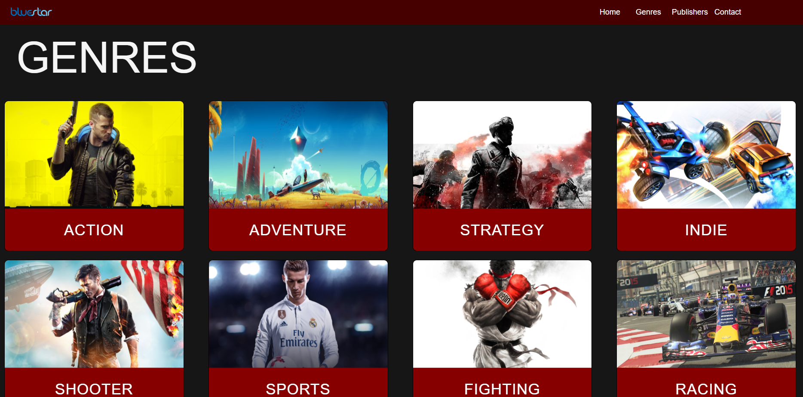

# Bluestar

Bluestar is a website that offers a comprehensive catalog of games along with detailed information about genres and publishers. It provides an interactive and responsive user interface for game enthusiasts to explore their favorite games.

## Features

- Extensive Game Library: Bluestar boasts a vast collection of games, allowing users to discover and explore their favorite titles.

- Genre and Publisher Details: Users can access in-depth information about game genres and publishers to make informed decisions.

- Responsive Design: The user interface is built using React JS and CSS, ensuring it's responsive and adaptable to various devices and screen sizes.

- Real-Time Game Data: Bluestar fetches game data from the RAWG Game API, ensuring that the information is always up-to-date and accurate.

## Technologies Used

- Frontend: React JS and CSS
- Data Source: RAWG Game API

## Getting Started

To dive into the world of games and explore the Bluestar website, follow these simple steps:

1. Visit the [Bluestar Website](https://bluestarbyprashant.vercel.app)
2. Browse through the extensive game genres and publishers.
3. Click on a genre or publisher to access detailed information about various games.

Happy gaming!
